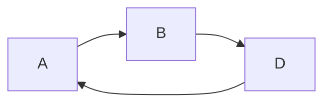

# Aufgabe
Janina hat von ihrer Freundin Nadine ein Rätsel aus dem Internet zugeschickt bekommen:
Wie viele Dreiecke sind in dieser Zeichnung zu sehen?

Nachdem Janina eine Weile Dreiecke gezählt hat, will sie ihr Ergebnis im Internet nachprüfen.
Sie findet aber keine Lösung, sondern nur weitere Rätsel dieser Art.
Da sie sich nicht jedes Mal erneut ans Zählen machen will, überlegt sie, ob sich solche Rätsel mit einem Computer lösen lassen.

Versetze dich in Janinas Lage und schreibe ein Programm, das die Dreiecke in einer Rätsel-Zeichnung zählt.
Eine Zeichnung besteht aus einigen Strecken.
Du kannst davon ausgehen, dass keine zwei Strecken auf derselben Geraden liegen und dass sich nie mehr als zwei Strecken im gleichen Punkt schneiden.
In der obigen Zeichnung sind übrigens neun Dreiecke zu finden.
Wende dein Programm auf die Beispiele an, die du auf den BwInf-Webseiten findest.

# Lösungsansatz

Ein Dreieck lässt sich definieren als:
> Drei Strecken, die einander schneiden.

Diese Eigenschaft eines Dreiecks machen wir uns zunutze:
Wir tragen alle Strecken in einen gerichteten Graphen auf, in dem
- jede Strecke durch einen Knotenpunkt dargestellt wird
- jeder Knotenpunkt mit den Knoten verbunden ist, dessen Strecke sich mit seiner schneidet

Nun kann man die oben genannte Eigenschaft des Dreiecks nutzen:
Findet man in diesem Graphen einen Weg, durch bewegen an drei Kanten wieder zum Ausgangsknoten zu kommen, hat man ein Dreieck gefunden.

An einer Skizze wird das ganze ein wenig deutlicher:

Folgende Wege sind möglich:

Dementsprechend sind in er Skizze 2 Dreiecke versteckt.

Der Lösungsansatz sieht also wie folgt aus:
- Stelle den Graphen auf
- Finde im Graphen alle Möglichkeiten, in 3 Schritten wieder den Ausgangsknoten zu erreichen

Um den Graphen überhaupt erst einmal aufzustellen, muss ich wissen wann sich zwei Strecken schneiden.
Dafür kann man Vektor-Rechnung benutzen.

# Besonderheiten in der Implementierung

# Fazit