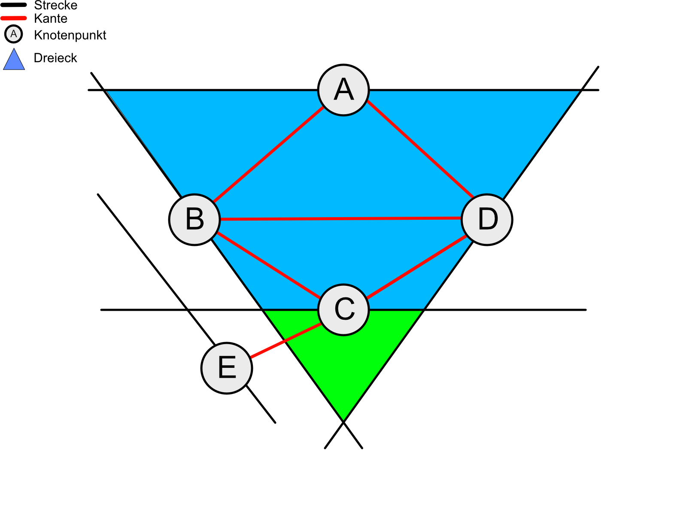
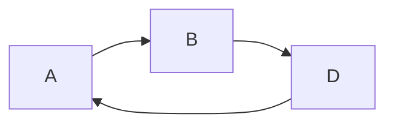
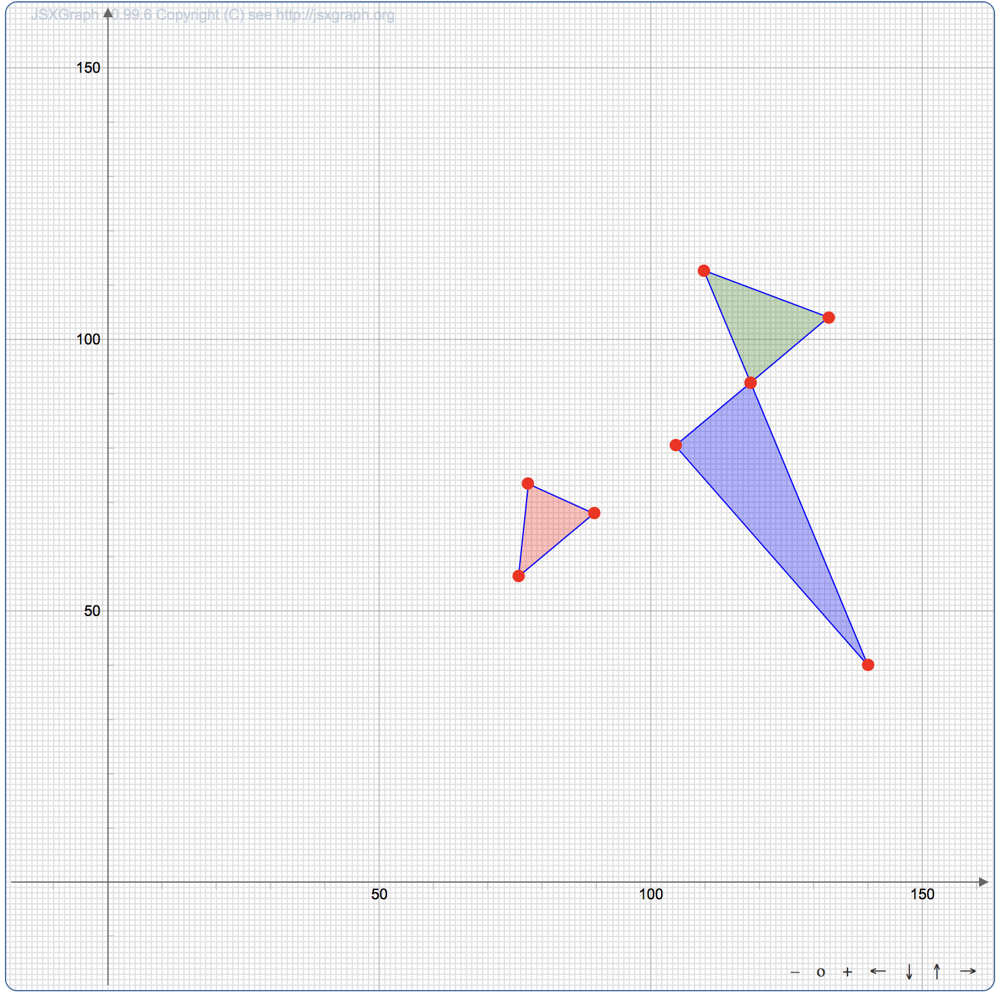
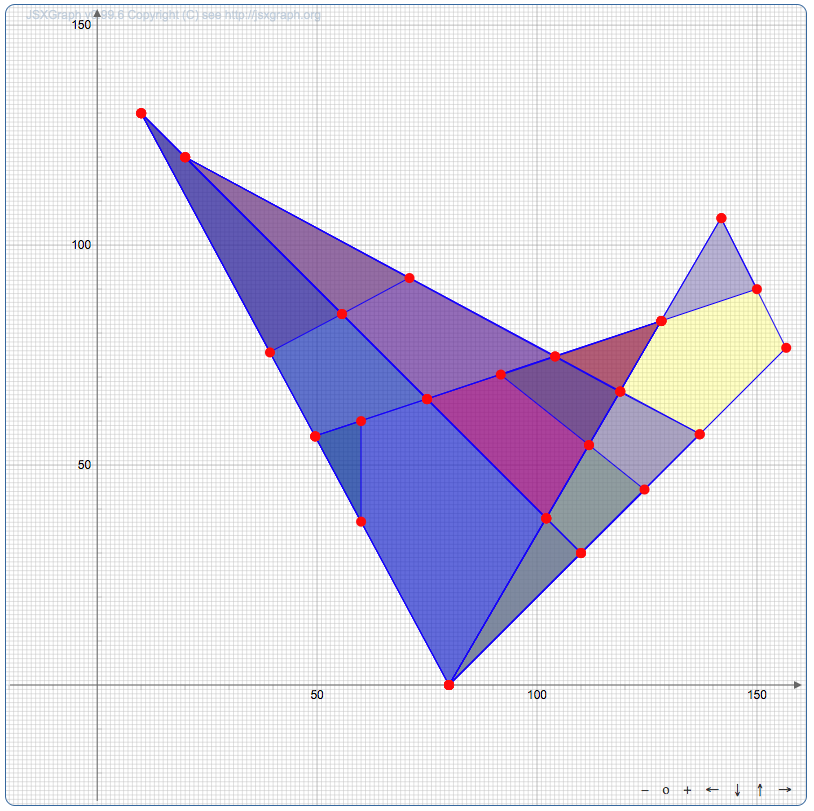

# Lösungsansatz
In dieser Aufgabe lässt sich ein Dreieck wie folgt definieren:

> Drei Strecken, die einander schneiden.

Dies machen wir uns zunutze:
Wir tragen alle Strecken in einen gerichteten Graphen auf, in dem

- jede Strecke durch einen Knotenpunkt dargestellt wird
- jeder Knotenpunkt mit den Knoten verbunden ist, dessen Strecke sich mit seiner schneidet

Nun kann man die oben genannte Eigenschaft des Dreiecks nutzen:
Findet man in diesem Graphen einen Weg, durch bewegen an drei Kanten wieder zum Ausgangsknoten zu kommen, hat man ein Dreieck gefunden.

An der Skizze $Figure 1$ wird das ein wenig deutlicher.



Folgende Wege sind möglich:



Dementsprechend sind in der Skizze zwei Dreiecke versteckt.

Der Lösungsansatz sieht also wie folgt aus:

- Stelle den Graphen auf
- Finde im Graphen alle Möglichkeiten, in 3 Schritten wieder den Ausgangsknoten zu erreichen

Um den Graphen überhaupt erst einmal aufzustellen, muss ich wissen wann sich zwei Strecken schneiden.
Dafür kann man Vektor-Rechnung benutzen.

## Ermittlung eines Schnittpunktes zweier Strecken
Strecke 1 sei gegeben durch $P_0(x_0 | y_0)$ und $P_1(x_1 | y_1)$.
Strecke 2 sei gegeben durch $P_2(x_2 | y_2)$ und $P_3(x_3 | y_3)$.

Wir bestimmen zunächst die beiden vektoriellen Geradengleichungen, die jeweils eine Strecke beinhalten:

$$
\left(
  \begin{matrix}
  x \\ y
  \end{matrix}
\right) =
\left(
  \begin{matrix}
  x_0 \\ y_0
  \end{matrix}
\right) +
a\cdot\left(
  \begin{matrix}
  x_1-x_0 \\ y_1-y_0
  \end{matrix}
\right)
$$

$$
\left(
  \begin{matrix}
  x \\ y
  \end{matrix}
\right) =
\left(
  \begin{matrix}
  x_2 \\ y_2
  \end{matrix}
\right) +
b \cdot\left(
  \begin{matrix}
  x_3-x_2 \\ y_3-y_2
  \end{matrix}
\right)
$$

Die Parameter $a$ und $b$, für die die beiden Strecken einen gemeinsamen Schnittpunkt haben, ergeben sich zu

$$
a =
\frac{
(x_3 - x_0) \cdot y_2  - (x_2 - x_0) \cdot y_3 - (x_3 - x_2) \cdot y_0
}{
(y_1 - y_0) \cdot (x_3 - x_2) - (x_1 - x_0) \cdot (y_3 - y_2)
}
$$

$$
b =
\frac{
(x_1 - x_0) \cdot y_2  - (x_2 - x_0) \cdot y_1 + (x_2 - x_1) \cdot y_0
}{
(y_1 - y_0) \cdot (x_3 - x_2) - (x_1 - x_0) \cdot (y_3 - y_2)
}
$$

Die Lösung ist nur gültig, wenn

$$
a, b \in [0; 1]
$$

In diesem Fall ergibt sich der Schnittpunkt $(x; y)$ aus den oben genannten Geradengleichungen.


# Umsetzung
Ich habe die Implementierung bereits im Quellcode dokumentiert.
Die wichtigsten Dinge werden im folgenden gesondert erläutert.

## Architektur der Lösung
Der Code besteht aus folgenden drei Teilen:

- Input
  - Nimmt die Nutzereingaben entgegen
  - Klasen:
    - InputSwing
      - Simple Swing-GUI
    - InputReader
      - Parser, um aus den Eingaben `Line2D`-Objekte zu erzeugen
- Berechnung
  - Eigentlicher Algorithmus, berechnet die Dreiecke
  - Klassen:
    - Graph
      - Modelliert den Graphen
      - Kümmert sich um die Suche der Dreieecke
    - Triangle
      - Modelliert ein Dreieck
    - Geometry
      - enthält die Methoden zur Berechnung eines Schnittpunkts (Vektorrechnung)
- Output
  - Zeigt die gefundenen Dreiecke/Strecken der Eingabe an
  - OutputSwing
    - Zeigt Output in einem Swing-Fenster an
  - OutputWeb
    - Zeigt Output mithilfe `JSXGraph` in einem Browserfenster an

## Modellierung der Geometrischen Figuren
Um die Figuren zu modellieren, habe ich soweit es geht auf die Objekte des JDK zurückgegriffen.

### Punkt
Der Punkt wird durch das `Point2D`-Objekt aus dem AWT-Paket modelliert.
Ich benutze folgende Methoden:

- `Point2D.Double(double x, double y)`: Konstruktor für ein neues `Point2D`-Objekt mit doppelter Genauigkeit

- `.getX()`: Gibt den X-Wert des Punkts mit doppelter Genauigkeit zurück

- `.getY()`: Gibt den Y-Wert des Punkts mit doppelter Genauigkeit zurück

### Strecke
Die Strecke wird durch das `Line2D`-Objekt aus dem AWT-Paket modelliert.
Ich benutze folgende Methoden:

- `Line2D.Double(Point2D a, Point2D b)`: Konstruktor für ein neues `Line2D`-Objekt mit doppelter Genauigkeit

- `.getX1()`: Gibt den X-Wert des ersten Punkts der Strecke mit doppelter Genauigkeit zurück

- `.getY1()`: Gibt den Y-Wert des ersten Punkts der Strecke mit doppelter Genauigkeit zurück

- `.getX2()`: Gibt den X-Wert des zweiten Punkts der Strecke mit doppelter Genauigkeit zurück

- `.getY2()`: Gibt den Y-Wert des zweiten Punkts der Strecke mit doppelter Genauigkeit zurück

- `.getP1()`: Gibt den ersten Punkt der Strecke als `Point2D`-Objekt zurück

- `.getP2()`: Gibt den zweiten Punkt der Strecke als `Point2D`-Objekt zurück

### Dreieck
Dreiecke sind kein Teil des AWT-Pakets.
Deshalb habe ich dafür eine eigene Klasse modelliert.
Sie bietet die folgenden Methoden:

- `Triangle(Line2D a, Line2D b, Line2D c)`: Konstruktor für ein neues `Triangle`-Objekt aus den Strecken ${a, b, c}$. Speichert die Punkte immer sortiert ab.

- `.hash()`: Gibt die Werte des Dreiecks als String zurück. Wird zur eindeutigen identifizierung der Dreiecke verwendet.

- `.hasArea()`: Gibt zurück, ob das Dreieck eine Fläche hat.

- `.sides()`: Gibt die Seiten des Dreiecks als Array von `Line2D`-Objekten zurück

- `.compareTo(Triangle b)`: Vergleicht zwei Dreiecke mithilfe von `comparePoints()`. Wird genutzt, um Dreiecke zu sortieren.

- `comparePoints(Point2D a, Point2D b)`: Vergleicht zwei Punkte. Wird genutzt, um die Punkte des Dreiecks zu sortieren.

## Modellierung des Graphen
Im Graphen wird jeder Knotenpunkt durch ein Objekt der Klasse `Node` modelliert.
In diesem ist die eigene Strecke als `Line2D`-Objekt sowie Knotenpunkte, die mit ihm verbunden sind, in einer `ArrayList` gespeichert.

> Du kannst davon ausgehen, dass keine zwei Strecken auf derselben Geraden liegen [...]

Aus der Aufgabenstellung geht hervor, dass es keine identischen Strecken gibt.
Damit die gleiche Strecke nicht mehrmals im Graphen vorliegt, sind alle Knotenpunkte in einer `Map` gespeichert, in der sie durch einen Hash (bestehend aus ihren Koordinaten) eindeutig identifiziert werden.
Wird nun die gleiche Strecke zweimal hinzugefügt, so wird die Alte  überschrieben.

Die Erstellung des Graphen funktioniert wiefolgt:
Zuerst werden alle Knotenpunkte hinzugefügt.
Dann wird jeder Knoten mit jedem anderen verglichen ($O(n^2)$) und - falls nach der oben beschriebenen Methode eine Überschneidung besteht - eine Verbindung hergestellt (indem sie zur Liste der Schneidenden hinzugefügt wird).


## Durchsuchen des Graphen nach Dreiecken
Um im Graphen nun Dreiecke zu finden, durchsuche ich alle Knoten nach der Möglichkeit, mit drei Schritten an den Kanten zurück zum Ausgangsknoten zu kommen:

```java
for (Node a : nodes) {  // Ausgansknoten
  for (Node b : a.intersects) { // Schritt 1
  if (a == b) continue;

    for (Node c : b.intersects) { // Schritt 2
    if (a == c) continue;
    if (b == c) continue;

      for (Node d : c.intersects) { // Schritt 3
        if (a == d) { // Überprüfung, ob Ausgangsknoten
          // Dreieck gefunden
        }
      }
    }
  }
}
```
`.intersects` gibt die Knotenpunkte zurück, mit denen ein Knoten verbunden ist.

Innerhalb dieser Schleifen überspringe ich mit `continue;` die Durchläufe, die schon unter 3 Schritten wieder beim Ausgangsknoten sind oder sich an den Kanten zurück bewegen.

## User Interface
### Input
Für die Nutzereingabe habe ich eine kleine Swing-GUI geschrieben.
Diese bietet die Möglichkeit

- per Copy & Paste Eingaben einzufügen
- eine der Test-Eingaben auszuwählen
- Eine Linie durch Eingabefelder hinzuzufügen

### Output
Die Ergebnisse der Dreiecksfindung wird als Text-Ausgabe im unteren Fenster angezeigt.
Zusätzlich kann man sich In-/Output graphisch anzeigen lassen, den Input nur im Browser, den Output im Browser und in einer Swing-Zeichnung.

### Anzeige im Browser
Die Swing-Zeichnung ist zwar ganz schön, um sich die Dreiecke grob anzuschauen - man kann aber keine Koordinaten erkennen.

Dafür habe ich eine kleine Website erstellt, die die Bibliothek [JSXGraph](https://jsxgraph.uni-bayreuth.de) der Universität Bayreuth nutzt.

Diese besteht aus einem Template, in dem ich mit einer RegEx meine anzuzeigenden Objekte in `JSON`-Format einfüge.

```java
text.replaceAll("##POLYGON##", json);
```

Die JSON-Daten könnten in etwa so aussehen:

```json
[
  [[0.0, 0.0], [0.0, 200.0], [120.0, 0.0]],
  [[0.0, 20.0], [0.0, 200.0], [55.10204082, 108.16326531]],
  [[20.0, 0.0], [41.73913043, 130.43478261], [120.0, 0.0]],
  [[20.0, 0.0], [50.0, 180.0], [100.0, 0.0]],
  [[82.75862069, 62.06896552], [100.0, 0.0], [120.0, 0.0]]
];
```

Eckige Klammern markieren ein Array, wir haben hier also fünf Arrays bestehend aus jeweils drei Arrays mit jeweils einem Wertepaar bzw. Punkt.

Diese Werte werden dann von der Website mit einem kurzen Script zum `Board`, also zur Anzeigetafel, hinzugefügt.

# Testdateien
Mit den vorgegebenen Testdateien haben wir folgende Ergebnisse ermittelt:

## dreiecke1.txt


9 Dreiecke

```json
[
  [[0.0, 0.0], [0.0, 200.0], [120.0, 0.0]],
  [[0.0, 20.0], [0.0, 200.0], [55.10204082, 108.16326531]],
  [[20.0, 0.0], [41.73913043, 130.43478261], [120.0, 0.0]],
  [[20.0, 0.0], [50.0, 180.0], [100.0, 0.0]],
  [[31.81818182, 70.90909091], [41.73913043, 130.43478261], [55.10204082, 108.16326531]],
  [[31.81818182, 70.90909091], [50.0, 180.0], [65.38461538, 124.61538462]],
  [[41.73913043, 130.43478261], [50.0, 180.0], [82.75862069, 62.06896552]],
  [[55.10204082, 108.16326531], [65.38461538, 124.61538462], [82.75862069, 62.06896552]],
  [[82.75862069, 62.06896552], [100.0, 0.0], [120.0, 0.0]]
];
```

## dreiecke2.txt
Keine Dreiecke gefunden

## dreiecke3.txt


3 Dreiecke

```json
[
  [[75.63636364, 56.36363636], [77.34042553, 73.40425532], [89.56521739, 67.97101449]],
  [[104.57831325, 80.48192771], [118.35051546, 91.95876289], [140.0, 40.0]],
  [[109.75308642, 112.59259259], [118.35051546, 91.95876289], [132.75862069, 103.96551724]]
];
```

## dreiecke4.txt


5 Dreiecke

```json
[
  [[38.82352941, 141.76470588], [52.34042553, 129.14893617], [60.0, 110.0]],
  [[60.0, 110.0], [70.0, 85.0], [80.0, 80.0]],
  [[110.0, 130.0], [122.45762712, 128.22033898], [124.0, 102.0]],
  [[117.59124088, 68.24817518], [126.47302905, 59.95850622], [130.0, 0.0]],
  [[161.69230769, 122.61538462], [163.96226415, 132.83018868], [180.0, 120.0]]
];  
```

## dreiecke5.txt


1 Dreieck

```json
[
  [[61.73913043, 103.47826087], [73.33333333, 93.33333333], [80.0, 140.0]]
];  
```

## dreiecke6.txt


20 Dreiecke

```json
[
  [[10.0, 130.0], [39.28286853, 75.61752988], [55.65217391, 84.34782609]],
  [[10.0, 130.0], [49.56521739, 56.52173913], [75.0, 65.0]],
  [[10.0, 130.0], [80.0, 0.0], [102.10526316, 37.89473684]],
  [[10.0, 130.0], [80.0, 0.0], [110.0, 30.0]],
  [[20.0, 120.0], [55.65217391, 84.34782609], [71.00478469, 92.53588517]],
  [[20.0, 120.0], [75.0, 65.0], [104.11764706, 74.70588235]],
  [[20.0, 120.0], [102.10526316, 37.89473684], [118.92682927, 66.73170732]],
  [[20.0, 120.0], [110.0, 30.0], [137.0, 57.0]],
  [[49.56521739, 56.52173913], [60.0, 37.14285714], [60.0, 60.0]],
  [[49.56521739, 56.52173913], [80.0, 0.0], [128.27586207, 82.75862069]],
  [[50.0, 170.0], [98.46153846, 175.38461538], [120.0, 170.0]],
  [[50.0, 170.0], [140.0, 180.0], [160.0, 170.0]],
  [[75.0, 65.0], [102.10526316, 37.89473684], [128.27586207, 82.75862069]],
  [[80.0, 0.0], [102.10526316, 37.89473684], [110.0, 30.0]],
  [[80.0, 0.0], [111.81818182, 54.54545455], [124.44444444, 44.44444444]],
  [[80.0, 0.0], [118.92682927, 66.73170732], [137.0, 57.0]],
  [[80.0, 0.0], [141.92307692, 106.15384615], [156.66666667, 76.66666667]],
  [[91.76470588, 70.58823529], [111.81818182, 54.54545455], [128.27586207, 82.75862069]],
  [[104.11764706, 74.70588235], [118.92682927, 66.73170732], [128.27586207, 82.75862069]],
  [[128.27586207, 82.75862069], [141.92307692, 106.15384615], [150.0, 90.0]]
];    
```
